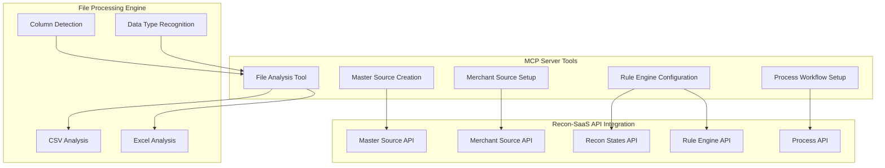

# Recon-SaaS MCP Server: Self-Serve Merchant Onboarding Solution

## Executive Summary

The Recon-SaaS MCP (Model Context Protocol) Server revolutionizes merchant onboarding by automating a previously manual 2-3 day engineering process into a 5-minute self-serve experience. This solution eliminates the need for dedicated engineering resources for each new merchant onboarding, enabling scalable, automated reconciliation setup.

## Problem Statement

### Traditional Onboarding Challenges
- **Time-Intensive Process**: Manual onboarding required 2-3 days of engineering effort
- **Resource Bottleneck**: Engineers needed for every new merchant setup
- **Complex Configuration**: Multiple manual steps including:
  - File analysis and column identification
  - Master source configuration creation
  - Column mapping and transformation setup
  - Rule engine configuration with priorities
  - Process workflow definition
- **Inconsistent Results**: Manual configuration led to errors and inconsistencies
- **Scalability Issues**: Limited by available engineering bandwidth

## Solution Architecture

### MCP Server Implementation
The solution leverages the Model Context Protocol to create an intelligent, automated onboarding system with the following components:



### Core Tools and Functionality

#### 1. **File Analysis Tool** (`recon_file_analysis`)
- **Purpose**: Automatically analyzes uploaded reconciliation files
- **Capabilities**:
  - CSV and Excel file parsing
  - Column identification and data type detection
  - EntityID candidate identification (Transaction ID, Reference Number, etc.)
  - Amount column detection with monetary value recognition
  - Uniqueness analysis for identifier columns
  - Sample data extraction for validation

#### 2. **Master Source Creation** (`recon_master_source`)
- **Purpose**: Creates reusable master source configurations
- **Features**:
  - Automatic schema generation from file columns
  - Column mapping configuration
  - EntityID and Amount field designation
  - Source schema validation
  - API integration with recon-saas backend

#### 3. **Merchant Source Setup** (`recon_merchant_source`)
- **Purpose**: Creates merchant-specific source instances
- **Capabilities**:
  - Merchant ID association
  - Naming strategy implementation (descriptive, timestamp, sequential)
  - Master source linking
  - Upload configuration setup

#### 4. **Rule Engine Configuration** (`recon_state_rule`)
- **Purpose**: Sets up reconciliation rules and states
- **Features**:
  - Automatic rule expression generation
  - Validation modes (automatic, guided, manual)
  - Recon state creation (Reconciled, Unreconciled, Missing Records)
  - Priority-based rule ordering
  - Expression approval workflows

#### 5. **Process Workflow Setup** (`recon_process_setup`)
- **Purpose**: Creates complete reconciliation processes
- **Capabilities**:
  - Lookup configuration creation
  - Master and merchant recon process setup
  - Column mapping for reporting
  - Rule integration
  - End-to-end workflow configuration

## Technical Implementation

### High-Level Code Architecture

```go
// Core MCP Tool Structure
func ReconFileAnalysisTool() server.ServerTool {
    tool := mcp.NewTool("recon_file_analysis",
        mcp.WithDescription("Analyze uploaded reconciliation files..."),
        mcp.WithString("file1_path", mcp.Description("First file path"), mcp.Required()),
        mcp.WithString("file2_path", mcp.Description("Second file path"), mcp.Required()),
        // ... additional parameters
    )
    
    handler := func(ctx context.Context, request mcp.CallToolRequest) (*mcp.CallToolResult, error) {
        // File analysis logic
        // Column detection algorithms
        // API integration calls
        // Result formatting
    }
    
    return server.ServerTool{Tool: tool, Handler: handler}
}
```

### Key Technical Features

#### 1. **Intelligent Column Detection**
```go
// EntityID Candidate Identification
func identifyEntityIDCandidates(headers []string, columnAnalysis map[string]map[string]interface{}) []interface{} {
    idPatterns := []string{
        "(?i)(transaction[_\\s]*id|txn[_\\s]*id)",
        "(?i)(entity[_\\s]*id|ent[_\\s]*id)",
        "(?i)(reference[_\\s]*(number|no|num|id)|ref[_\\s]*(no|num|id))",
        // ... additional patterns
    }
    
    // Pattern matching with confidence scoring
    // Uniqueness analysis
    // Sample data validation
}
```

#### 2. **API Integration Layer**
```go
// Recon-SaaS API Communication
func makeReconSaaSAPICall(ctx context.Context, method, endpoint string, payload interface{}) (map[string]interface{}, error) {
    const baseURL = "https://recon-saas.dev.razorpay.in"
    const authHeader = "Basic cmVjb24tc2FhczpyZWNvbi1zYWFz"
    
    // HTTP client with timeout
    // Authentication handling
    // Error management
    // Response parsing
}
```

#### 3. **Validation and Error Handling**
```go
// Validation Mode Processing
func applyValidationMode(mode string, approveExpressions bool, masterSourceID1, masterSourceID2 string) (*ValidationResult, error) {
    // Automatic validation
    // Guided validation with user approval
    // Manual validation requiring explicit review
    // Rule expression generation and validation
}
```

## Onboarding Process Flow

### 5-Minute Automated Workflow

1. **File Upload & Analysis** (1 minute)
   - Upload transaction and bank statement files
   - Automatic column detection and analysis
   - EntityID and Amount field identification

2. **Master Source Creation** (1 minute)
   - Generate source schemas automatically
   - Configure column mappings
   - Create reusable master configurations

3. **Merchant Source Setup** (1 minute)
   - Associate with merchant ID
   - Apply naming conventions
   - Link to master sources

4. **Rule Engine Configuration** (1 minute)
   - Generate reconciliation rules
   - Set up recon states
   - Configure validation workflows

5. **Process Workflow Creation** (1 minute)
   - Create lookup configurations
   - Set up reconciliation processes
   - Configure reporting and monitoring

## Benefits and Impact

### Quantitative Benefits
- **Time Reduction**: 2-3 days → 5 minutes (99.3% reduction)
- **Resource Efficiency**: Eliminates engineering dependency
- **Scalability**: Unlimited concurrent onboarding
- **Error Reduction**: Automated validation prevents configuration errors
- **Consistency**: Standardized setup across all merchants

### Qualitative Benefits
- **Self-Service Capability**: Merchants can onboard independently
- **Reduced Engineering Load**: Engineers focus on core product development
- **Improved Customer Experience**: Faster time-to-value
- **Standardization**: Consistent configuration patterns
- **Audit Trail**: Complete automation logging

## Integration Capabilities

### MCP Client Support
- **Claude Desktop**: Direct integration via MCP protocol
- **Cursor IDE**: Seamless development environment integration
- **HTTP Clients**: RESTful API access
- **Custom Applications**: SDK integration

### Recon-SaaS Backend Integration
- **Master Source Management**: Automated source creation
- **Merchant Source Configuration**: Dynamic merchant setup
- **Rule Engine**: Intelligent rule generation
- **Process Management**: End-to-end workflow automation
- **Reporting**: Automated report configuration

## Future Enhancements

### Planned Capabilities
- **Machine Learning Integration**: Enhanced column detection accuracy
- **Template Library**: Pre-built configurations for common use cases
- **Advanced Validation**: Multi-file consistency checking
- **Real-time Monitoring**: Live onboarding progress tracking
- **Custom Rule Builder**: Visual rule creation interface

## Conclusion

The Recon-SaaS MCP Server represents a paradigm shift in merchant onboarding, transforming a manual, time-intensive process into an automated, self-serve experience. By leveraging intelligent file analysis, automated configuration generation, and seamless API integration, this solution delivers unprecedented efficiency and scalability while maintaining the quality and consistency of manual engineering work.

The 5-minute onboarding capability not only reduces operational costs but also significantly improves customer satisfaction and enables rapid business growth through scalable merchant acquisition processes.

---

*This solution demonstrates the power of MCP (Model Context Protocol) in creating intelligent, automated workflows that bridge the gap between complex business processes and user-friendly self-service capabilities.* 